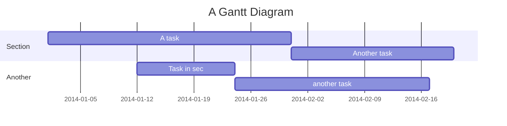
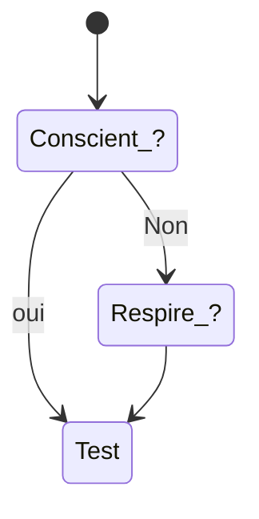

```mermaid  
gantt
        title A Gantt Diagram
        dateFormat  YYYY-MM-DD
        section Section
        A task           :a1, 2014-01-01, 30d
        Another task     :after a1  , 20d
        section Another
        Task in sec      :2014-01-12  , 12d
        another task      : 24d

```

```mermaid
stateDiagram-v2
        state <<choice>>
        [*] --> Conscient_?
        Conscient_? --> Respire_?: Non
        Conscient_? --> Test : oui
		Respire_? --> Test
```

