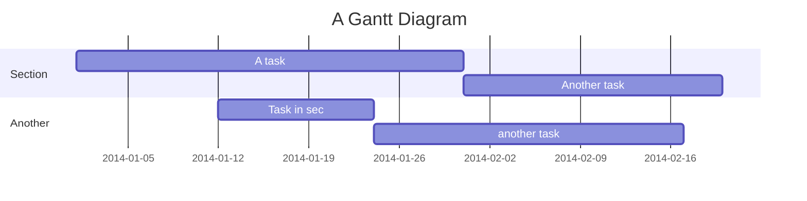
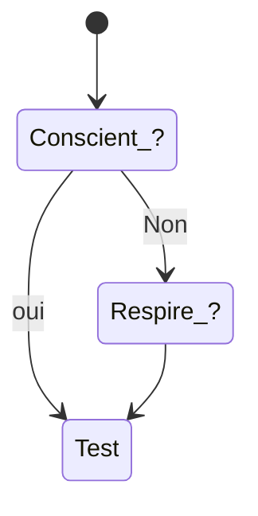
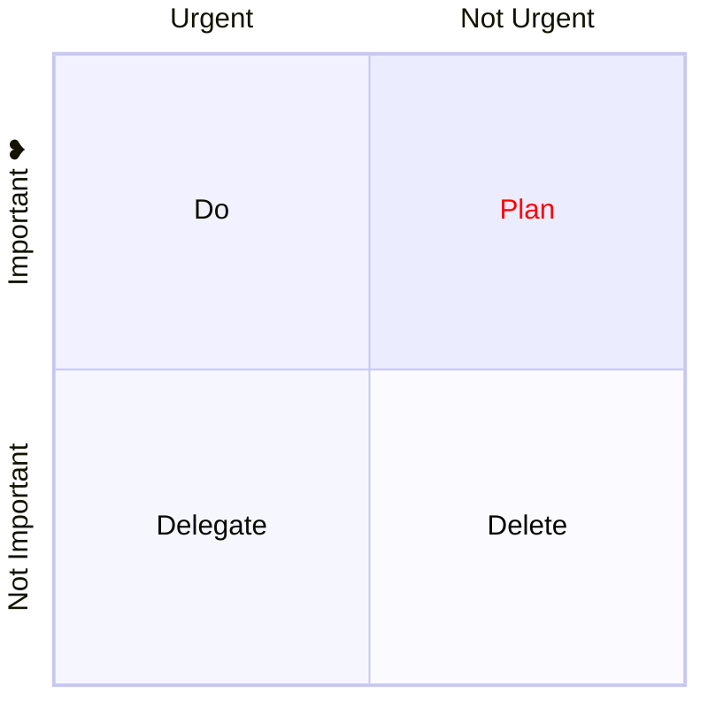
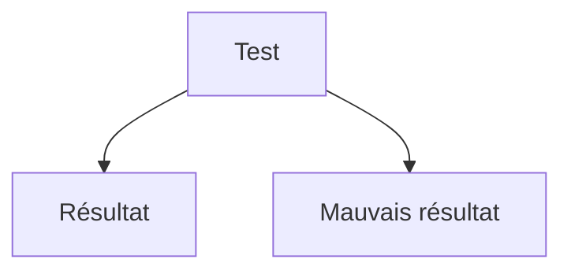
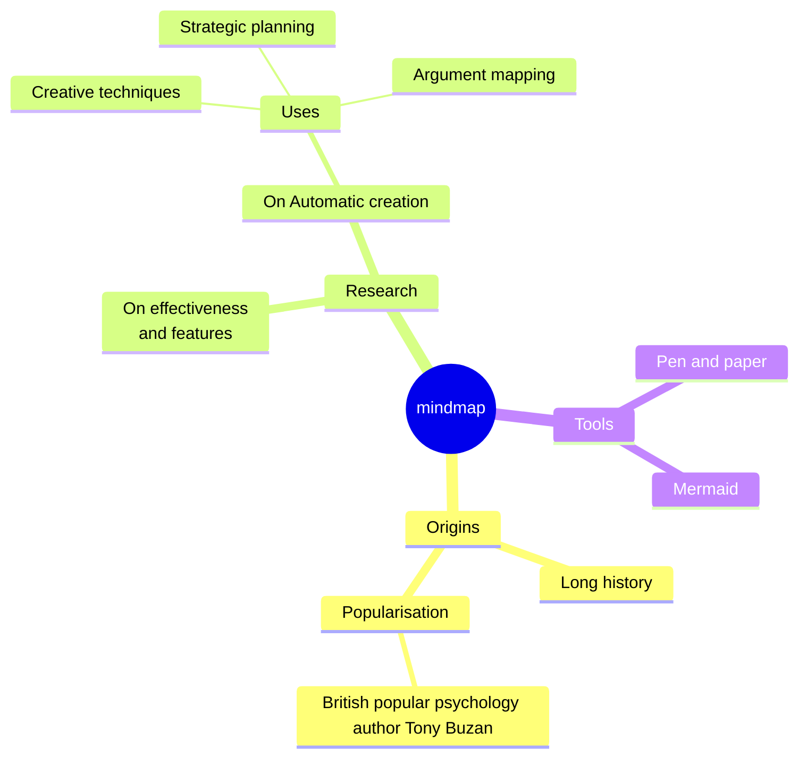

```mermaid  
gantt
        title A Gantt Diagram
        dateFormat  YYYY-MM-DD
        section Section
        A task           :a1, 2014-01-01, 30d
        Another task     :after a1  , 20d
        section Another
        Task in sec      :2014-01-12  , 12d
        another task      : 24d

```

```mermaid
stateDiagram-v2
        state <<choice>>
        [*] --> Conscient_?
        Conscient_? --> Respire_?: Non
        Conscient_? --> Test : oui
		Respire_? --> Test
```

```mermaid
%%{init: {"quadrantChart": {"chartWidth": 400, "chartHeight": 400}, "themeVariables": {"quadrant1TextFill": "#ff0000"} }}%%
		quadrantChart
		  x-axis Urgent --> Not Urgent
		  y-axis Not Important --> "Important ❤"
		  quadrant-1 Plan
		  quadrant-2 Do
		  quadrant-3 Delegate
		  quadrant-4 Delete

```

```mermaid
graph TD;
    A[Test] -->| | B[Résultat];
    A -->| | C[Mauvais résultat];

```

```mermaid
mindmap
	root((mindmap))
		Origins
			Long history
			::icon(fa fa-book)
			Popularisation
				British popular psychology author Tony Buzan
		Research
			On effectiveness<br/>and features
			On Automatic creation
				Uses
					Creative techniques
					Strategic planning
					Argument mapping
		Tools
			Pen and paper
			Mermaid
```
